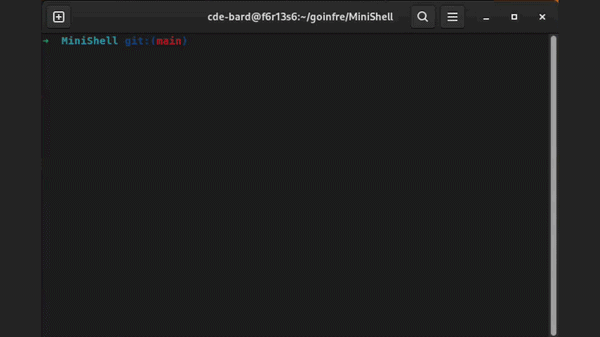

# MiniShell



## Description

MiniShell is a project developed at 42 Paris in a team of two.  
The goal is to implement a basic Unix shell that can interpret and execute commands, handle pipes, redirections, and built-in commands.

This project allows understanding how shells work at a low level, including process creation, signal handling, and I/O redirection.

## Requirements

This project works on **Linux**.

It can also run on Windows using **WSL (Windows Subsystem for Linux)** with a Linux distribution.

## Compilation

```bash
make all
```

## Execution

```bash
./minishell
```

Once running, you can type commands like a standard shell:

```bash
ls -l
echo "Hello world" > out.txt
cat file.txt | grep "pattern"
```

## Authors

- Noam Gauthreau--Massela  
- Celian de Segonzac
